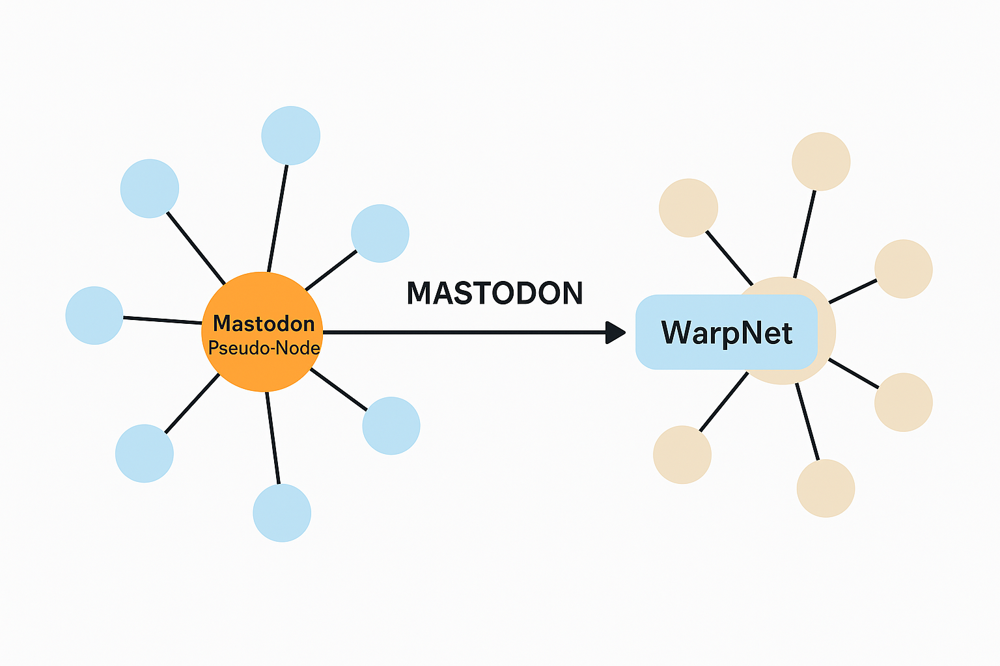

### Mastodon Integration (Read-Only Bridge)

WarpNet now includes read-only integration with the Mastodon social network.

This integration is implemented via the public Mastodon API. A dedicated WarpNet account has been 
created within the Mastodon network, and a special **bridge pseudo-node** has been introduced inside 
WarpNet to represent this external data source.

The bridge node periodically fetches public content from Mastodon and imports it into WarpNet in a 
read-only manner. This content is treated similarly to local user posts, but is clearly marked as 
originating from Mastodon and cannot be modified or replied to within WarpNet.

**Key purposes of this integration:**

* **Test data source**: Mastodon provides a stable stream of public social content for testing and 
  development within WarpNet.
* **Initial content population**: New WarpNet nodes can display real content from day one, enhancing the 
  user experience.
* **Migration path**: This feature lowers the barrier for users and communities who want to migrate 
  from Mastodon to WarpNet by offering familiar content and potential import tools in the future.

This is a one-way (read-only) bridge. WarpNet does not post or interact with Mastodon on behalf of users.
