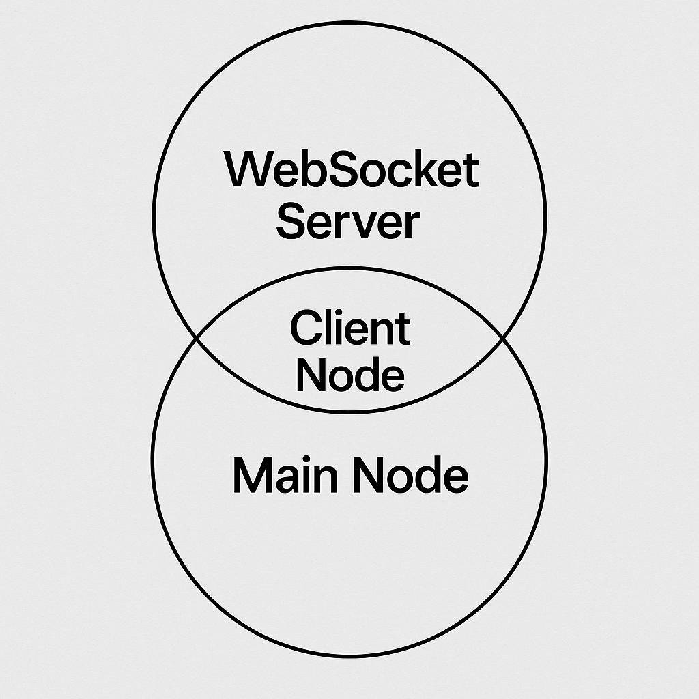

### Member Node Architecture

A **member node** is the core unit of WarpNet used by regular users. It consists of several internal components 
that handle message intake, routing, storage, and optional propagation to the network.
The architecture is designed to **separate responsibilities**, ensure **local privacy boundaries**, 
and support **modular extension**.

---

#### Message Lifecycle (User → Network)

Here is the message flow through the internal architecture of a member node:

---

#### 1. **Frontend Input**

* "Frontend" is implemented as a Site Specific Browser (SSB) app.
* A site-specific browser (SSB) is a software application dedicated to accessing pages 
  from a single source (site) on a computer network such as the Internet or a private intranet. 
  SSBs typically simplify the more complex functions of a web browser by excluding the menus, 
  toolbars and browser graphical user interface associated with functions that are external to 
  the workings of a single site.

---

#### 2 and 3 are deprecated

#### 4. **Main Node Component**

* The **main node** (or “core node”) handles **persistence and network propagation**.
* It receives the message from the client node and:

    * Writes it to **BadgerDB** with a deterministic key
    * Optionally forwards it to **other peer nodes** via libp2p (using broadcast or direct connection)

---

#### 5. **Network Dissemination (Optional)**

* Based on node settings and message type, the message may be:

    * Broadcast to trusted peers (public posts)
    * Sent directly to recipients (private messages)
    * Withheld entirely (private or draft content)

---

### Internal Component Summary

| Component         | Responsibility                                                 |
| ----------------- |----------------------------------------------------------------|
| **Frontend**      | Site Specific Browser (SSB) app                                |
| **Main Node**     | Stores messages, propagates to network, applies moderation     |
| **Storage Layer** | Writes all persisted data using BadgerDB with ordered keys     |

---

> The separation between *client node* and *main node* ensures that business logic (routing, protocol parsing) 
> remains decoupled from long-term storage and peer interaction.

---
