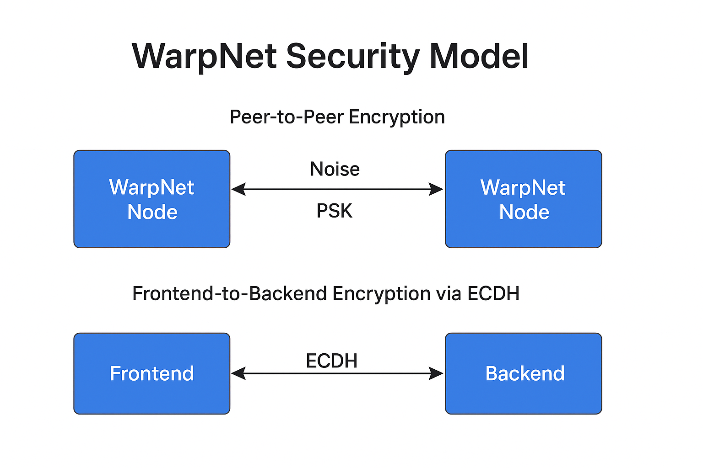

# WarpNet Security Model



WarpNet is designed as a secure, decentralized, serverless communication system. Its security architecture 
is layered and cryptographically grounded, with no need for third-party trust or certification authorities.

## 1. Storage Layer Security (main security level)

WarpNet uses [BadgerDB](https://github.com/dgraph-io/badger) as its embedded storage engine. 
All user data is stored locally and **encrypted at rest**.

### Encrypted Local Database

When the node is started, it requires the user to log in with a **username and password**. 
These credentials are used to:

1. **Unlock and decrypt** the BadgerDB database
2. **Generate an in-memory session token** used for frontend-backend authentication
3. **Derive the node’s long-term private key**

> This means that access to the database is impossible without the correct username/password pair. 
> There is no "backdoor", recovery key, or fallback mode (yet).

---

### Credential-Derived Secrets

On login, the following occurs:

#### Session Token Generation

A random + time-based seed is hashed to create a one-time session token:

```javascript
tokenSeed = username + "@" + password + "@" + randomChar + "@" + currentTime
token = sha256(tokenSeed)
```

This token is used for authenticating requests from the frontend (e.g. over WebSocket) and from client node.

#### Deterministic Private Key

The node's private key is derived deterministically from the login credentials:

```javascript
pkSeed = sha256(username + "@" + password + repeat("@", password.length)) // no random
privateKey = GenerateKeyFromSeed(pkSeed)
```

This ensures that the private key is:

* **Not stored on disk**
* Reproducible from credentials alone
* Consistent between sessions (if the user logs in again)

> ⚠️ If the user forgets their password, the private key and database are unrecoverable.

---

### File-level Protection

BadgerDB files are only accessible to the user that runs the node. It is recommended to use file-system encryption 
and OS-level sandboxing in addition to the internal crypto.

---

## 2. Peer-to-Peer Encryption with Noise + PSK

All WarpNet nodes communicate using [libp2p](https://libp2p.io), which provides an encrypted transport layer using 
the **Noise Protocol Framework**. Specifically, WarpNet uses the `XX` handshake pattern (or `IK` depending on 
configuration), combined with a **Pre-Shared Key (PSK)** to gate network access.

### Key Features

- **End-to-end encryption** between nodes using Noise
- **Mutual authentication** without certificates
- **Session keys** established via **ephemeral Diffie-Hellman**
- **Access control** via PSK — only authorized nodes can connect

### No Certificates Required

- No TLS, no certificate authorities
- Each libp2p node generates its own asymmetric keypair (e.g. Ed25519)
- The Noise handshake handles identity and encryption without central trust anchors

---

## 3. Pre-Shared Key (PSK)

The PSK acts as a **gatekeeping mechanism** — nodes with mismatched PSKs cannot connect or handshake.

### PSK Derivation Logic

The PSK is derived locally at node startup as follows:

```javascript
seed = networkName + codeHash + majorVersion + entropy
psk = sha256(seed)
````

### Input Components:

* `networkName` — network name (e.g. `mainnet`, `testnet`)
* `codeHash` — SHA-256 of the current codebase
* `majorVersion` — semantic version (e.g. 1 from 1.2.3)
* `entropy` — locally generated (anchored) entropy for uniqueness

This approach ensures:

* All participating nodes run the **same code**
* Version mismatches or tampered codebases **fail silently**
* No static keys in repo; all PSK generation is dynamic and deterministic

---

## 4. Frontend-to-Backend Encryption via ECDH

To secure local UI interaction (e.g. browser frontend ↔ local node backend), WarpNet establishes a secure 
session using **Elliptic Curve Diffie-Hellman (ECDH)**:

### 🔄 Handshake Flow

1. Frontend generates ephemeral ECDH keypair using WebCrypto
2. Sends public key to backend via WebSocket
3. Backend replies with its own ephemeral key
4. Both derive the same symmetric session key via `ECDH(PubA, PrivB)`
5. All further communication is encrypted using this shared key

This protects against:

* Local man-in-the-middle (e.g. rogue browser extensions)
* Session hijacking on local ports
* Frontend/backend desynchronization

Session keys are valid per browser session only and not persisted.

---

## 5. Built-in Abuse Protection (libp2p Rate Limiting)

WarpNet leverages [libp2p’s built-in protection services](https://pkg.go.dev/github.com/libp2p/go-libp2p-p2p/security) to prevent abuse and denial-of-service (DoS):

### Included Protections:

* **Connection gating**: deny inbound peers based on PSK, IP, PeerID, etc.
* **Stream rate limiting**: per protocol, per peer
* **Dial-backoff**: exponential cooldown for bad/misbehaving peers
* **Resource management**: max open streams, buffers, memory usage per peer

These are enforced automatically by the libp2p host stack and can be customized via `ResourceManager` interfaces.

---
## Related Docs

- [Noise Protocol Framework Specification](http://www.noiseprotocol.org/)
- [Elliptic Curve Diffie-Hellman Wikipedia](https://en.wikipedia.org/wiki/Elliptic-curve_Diffie%E2%80%93Hellman)

---

