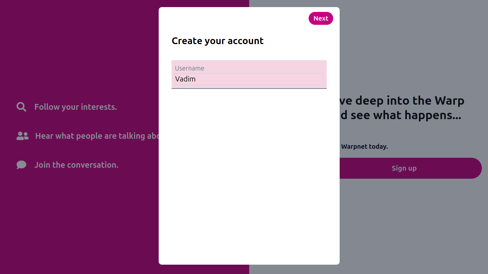

# User Guide

## Getting Started

WarpNet is a fully peer-to-peer social network. There are no central servers, logins, or registration — 
each user runs their own autonomous node.

To get started:

1. **Go to the official releases page:**
   [https://github.com/Warp-net/warpnet/releases](https://github.com/Warp-net/warpnet/releases)

2. **Download the binary for your operating system:**

    * Windows: `warpnet.exe`
    * macOS: `warpnet-darwin`
    * Linux: `warpnet-linux`

3. **Run the executable.**
   On first launch, you'll be asked to create a username and password.

That’s it — you’re online and in control.

---

## Sign up steps

### Step 1: click 'Sign up' button

### Step 2: create account username

### Step 3: read the important information and place a tick if you agree with it

### Step 4: compose password
* It is important to create a complex password: it must contain upper and lower case letters, special symbols, numbers.
* Password must have at least eight characters length. Max length is 32 characters. Empty password is not allowed.

### Step 5: read the Terms and the Privacy Policy and click final 'Sign up' button

---

## Important Notes

* **Your data is stored only on your machine.** If you lose your device or delete the database folder, 
  your account cannot be recovered.
* **There is no password reset.** Your password decrypts your local storage and regenerates your private key.
* **No internet signup is required.** The node connects directly to others via the P2P network.

---

## Need Help?

For usage questions or technical support, join the community:

* Telegram: https://t.me/warpnetdev
* GitHub Discussions: https://github.com/Warp-net/warpnet/discussions

---
